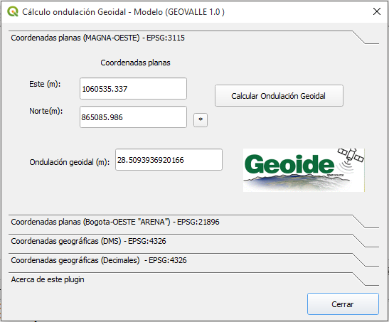

# GeoValleCVC - QGIS Plugin

Este plugin para QGIS calcula la ondulación geoidal para puntos de entrada en diferentes sistemas de referencia en el Valle del Cauca, para su calculo hace uso del Geoide local (GEOVALLE 1.0) (Opensource) desarrollado por la coorporación autonoma regional (CVC). Más información sobre el modelo geoidal GEOVALLE 1.0 en http://www.cvc.gov.co/

- Esta versión remplaza la antigua [GeoValleCVC](https://plugins.qgis.org/plugins/geovallecvc/) soportada solo  por QGIS 2.x  

## Captura 

Con este plugin usted puede:

- Calcular la ondulación geoidal para puntos de entrada en diferentes sistemas de referencia en el Valle del Cauca usando el  Geoide local (GEOVALLE 1.0) de la coorporación autonoma regional (CVC).

## Requerimientos

- QGIS 3x

## Descarga

El plugin puede ser descargado [geovallecvc.zip](geovallecvc.zip) e instalado en  QGIS desde el administrador de complementos -> opción (Instalar a partir de ZIP)

## Creditos

- [Andres Herrera](https://github.com/AndresHerrera/)
